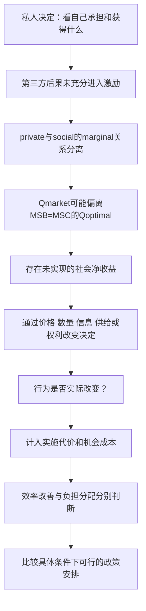

# Externalities：从真实长板书到轻量知识卡

这是知识阅读工作流的实做例。教学取舍由原材料、完整教材关系与官方考试证据共同形成；它不是以后每批固定53张的模板。

## 阅读与范围

输入是一张包含information、subsidy、regulation、direct provision、property rights及两道评分材料的长板书。逐段放大读全原图，包括圈画、曲线、教师提示和底部；顶部只露出tax/regulation标题，不能据此声称原板书已有完整机制。

教材实际完整研读Varian第8版：Ch16（印刷292–314／PDF318–340）、Ch33（631–643／657–669）、Ch34（644–666／670–692）、Ch36（694–717／720–743），共83页，连同图、例、Summary、Review Questions及适用附录。研究借助大学层次模型理解激励、资源与分配；学生卡只保留本批A-Level需要的关系。

考试边界是[9708 2026–2028 V2 syllabus](https://www.cambridgeinternational.org/Images/697423-2026-2028-syllabus.pdf)的7.3必要效率基础、7.4相关externalities、8.1.1中本主题工具及8.1.2；必要补充1.6的merit/public good区别（pp16、24、27–28）。不把相邻privatisation、整个moral hazard或完整CBA章自动加进来。

## Varian关系提炼

完整章阅读带来的关键区别：Ch16帮助分开财政transfer与资源损失；Ch33提醒总收益增加不等于人人获益；Ch34先讲权利与协商，再讲第三方成本如何进入决定；Ch36分开共同受益、私人付款与集体供给。学生不需要先学Edgeworth box、quasilinear证明、welfare-function最优化或VCG才能理解这些局部关系。

## 考试材料怎样实际改变设计

- 板书air travel题定位到9708/42 F/M2023 Q2。[对应ER p9](https://www.smartexamresources.com/files/9708_m23_er.pdf)明确要求negative consumption分析。于是保留MPB>MSB的图，单独解释tax改变supply wedge，不误画成原需求曲线自动左移。
- 板书正外部性题来自[2023 Specimen Paper4 Q2 MS pp9–10](https://www.cambridgeinternational.org/Images/596266-2023-specimen-paper-4-mark-scheme.pdf)，不是另一场真实考试。借其评价检查估值、时滞、机会成本与public provision激励，而非把indicative bullets当每题必写清单。
- 多年essay、多方向官方MCQ与[2023 ECR三份真实完整答卷](https://studylib.net/doc/27639244/815913724-9708-example-candidate-responses-paper-4-for-ex...)（pp15–21，16/20、10/20、5/20）帮助发现total与marginal、混合externality图、替代品的两个市场、nudge与强制、government failure局部损害与整体评价等缺口。ECR高稿也有机制和图解不足，不能因高分就照抄。
- 2023 ECR的EV题要求追踪市场：税燃油车改变燃油车supply，补贴EV改变EV supply；跨市场的替代响应另说明。更换动力不自动减拥堵，因此拥堵情境用公共交通替代私车的独立短例解释。

## 从关系到小卡

| 原来的宽问题 | 有用的小卡职责 |
|---|---|
| Subsidy纠正正外部性及所有评价 | 供给为何是MPC−s；最优补贴填哪一条marginal gap；MEB估值困难；财政机会成本；依赖激励；容量与时滞，各自解释闭合 |
| Property rights有效吗 | 权利与责任如何改变决定；具体补偿怎样让双方净得；transaction costs为何阻止互利协议 |
| 税的优劣 | price wedge与沿需求线移动；两类负外部性的不同图；quantity响应；估值；负担与规避 |
| 全部政策判断 | 实际新增净收益、不同条件下的具体比较、工具互补及副作用，作为整组连接 |

母图解释整体结构，单卡保留一个可反复阅读的局部。已有19张相关旧卡包含有用知识，但正常窗口的小字小图影响阅读；将19个旧目标纳入按原身份更新的方案，并为新增关系设计独立单元，不删除旧历史来“清空重来”。19个旧目标与34个新增单元形成53个阅读页面，47个范围内知识要求逐一映射；数量是这次材料与拆分的结果。

## 实物检查带来的修正

原板书下移的补贴线误标为MPC+subsidy，重画为MPC−s，并明确真实MSC未被付款机械降低。税／补贴的消费图中，社会交点与政策后的私人交点纵坐标不同、横坐标相同；分别标点能减轻初学者配对负担。生产图中政策线与社会线重合时，标签合并，避免文字重叠。

真正渲染还发现五处未转义小于号导致半句知识被HTML吞掉。修复作者源后重做speech，并给生成器加HTML内容完整性检查；不能因为JSON有节点、覆盖表能定位，就说学生看得到。Source里的研究JSON也需要保持可解析且不被字段编辑器当HTML。

独立评审发现一个缺口时，先比较具体替代：把public good两个属性另作一张，可以让direct provision卡仍轻；把抽象“取决于条件”换成真实条件→机制→选择的短例，比多列评价词更有用。修改后重新检查新版本内容与图，工程通过、制作端判断和用户真实体验分别记录。

此案例说明当前范围内的研究与设计方法，不保证未来所有题穷尽，也不把读过一批卡等同于已获得某个考试分数。
