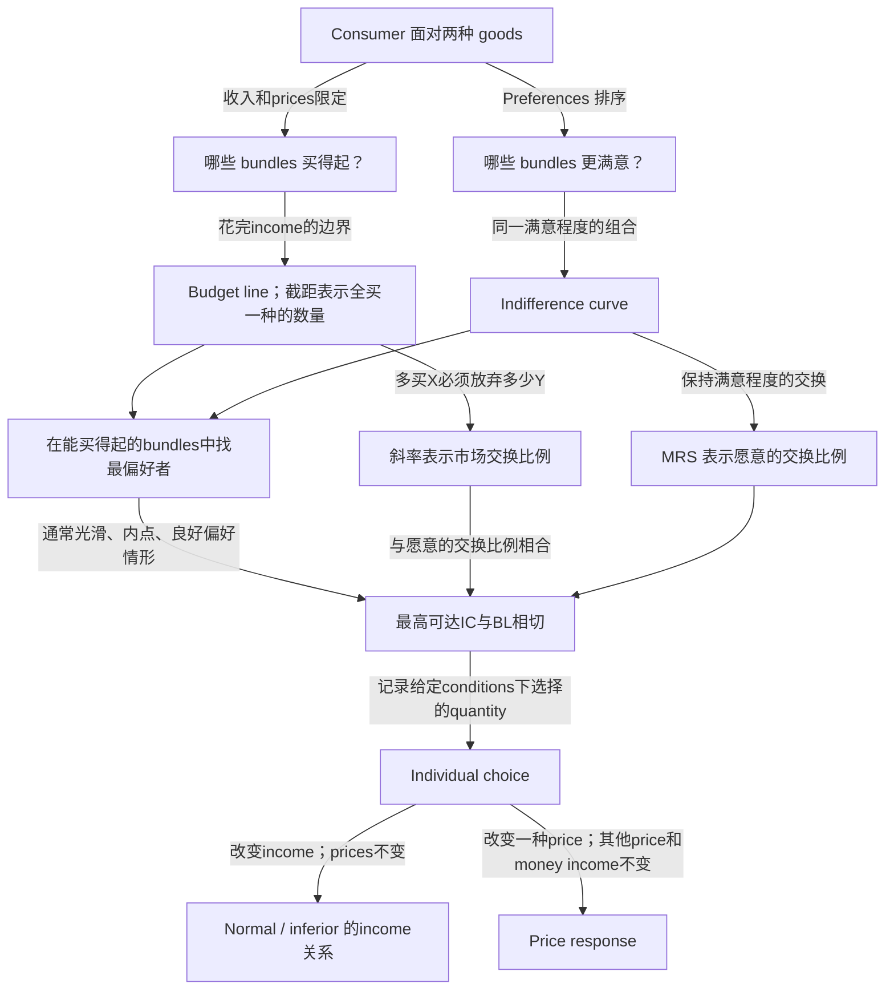
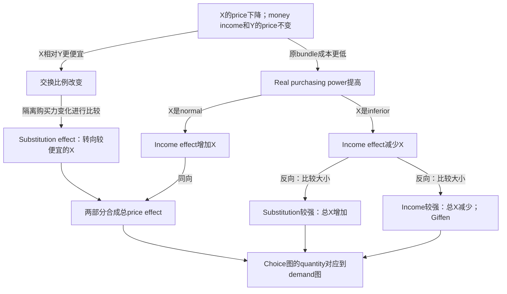
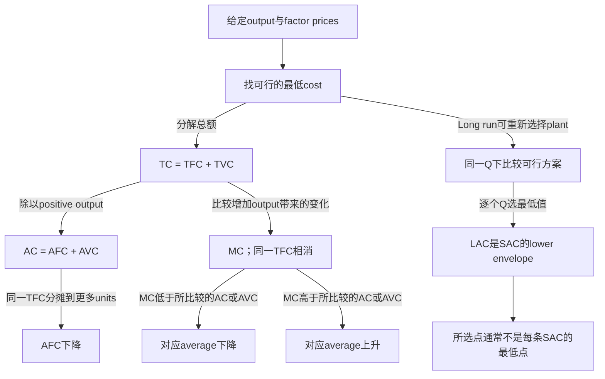
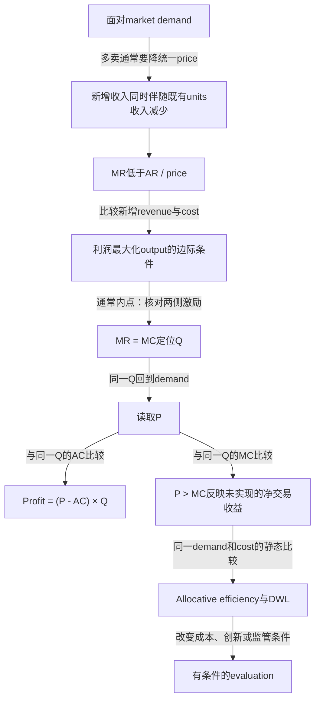

# Varian：从解释思路提炼母图，再分成知识卡

以下是完整研读后的原创关系提炼，展示一种制作方法。图是制作端母图，卡片从中提取局部关系；不是原书逐段改写，也不是已完成整章学习牌组。

## 原书与实际阅读范围

Hal R. Varian，*Intermediate Microeconomics: A Modern Approach*，8th edition，2010，ISBN 978-0-393-93424-3。本轮2026-10-03核对本机完整PDF的title/copyright/contents/preface，全文读完下列八章，共161个PDF页面，包含各章examples、summary、review questions及章内appendix。读过review questions不表示已完成所有习题。未声称读完整本806页PDF。

| 章节 | 纸书页 | PDF页序 | 完整阅读后提炼的主关系 |
|---|---|---|---|
| Ch2 Budget Constraint | 20–32 | 46–58 | 可负担集合、截距与交换比例；income和price分别怎样改变约束 |
| Ch3 Preferences | 33–53 | 59–79 | 对组合的排序如何成为IC；形状由偏好假设产生，MRS是愿意的交换比例 |
| Ch4 Utility | 54–72 | 80–98 | Utility表示排序；MU与MRS的含义及表示约定 |
| Ch5 Choice | 73–94 | 99–120 | 在可负担范围找最偏好的选择；解释最优而非仅背切点 |
| Ch6 Demand | 95–117 | 121–143 | 固定什么、改变什么，决定比较的是income response还是price response |
| Ch8 Slutsky Equation | 136–159 | 162–185 | 一次price变化的两条作用路径，income关系和effect大小决定总结果 |
| Ch21 Cost Curves | 378–394 | 404–420 | 总量、平均量、边际量与可选择plant分别承担不同关系 |
| Ch24 Monopoly | 439–460 | 465–486 | Demand约束选择，边际比较定位output，分别判断price、profit与welfare |

Consumer关键图页已视觉核对PDF48、50、100、164、179；producer图页核对408、414、416、418、419、468、474、478、480。抽取文本用于逐页阅读，渲染用于检查图形与公式。页码仅对应本版；其他版本重新核对目录。图的理论含义可复用，原书的历史政策／市场份额例子若作为现行事实使用须另查。

## Consumer choice：将三个不同的问题接起来

提炼出的教学价值：先让对象有意义，再解释约束、偏好和选择如何配合。Ch4帮助制作者理解ordinal表示与MU；CIE 7.1另有MU theory目标，不能将Varian的ordinal论述直接替换考纲中的cardinal教学路径。两种框架各自怎样用于题目，另行研究和连接。

## Price effect：变化与不变量共同解释结果

这张母图引出许多局部卡：BL slope、income shift、price pivot、名义income与purchasing power、IC与equilibrium、辅助线的含义、两种effects各自机制、某种good在一个变化方向下的总结果、choice到demand的对应、模型局限。每个需要独立解释的关系自然拥有自己的卡；完整图形分解按一种good和一个变化方向制作，不把三类goods全塞在同页。

Ch8完整读取使制作者辨认Slutsky与Hicks的不同：原bundle仍买得起，与保持原utility，是两种不同基准。正式图形选择一种并保持一致。有限price变化下混用基准会误导；相关高阶导数与duality留在制作者研究层。基本图形解释的需要按CIE材料核查，见syllabus-coverage.md。

## Cost Curves：不同操作得到不同曲线

这套结构形成总量分解、AFC分摊、MC与average、SR/LR选择等独立卡。关键区别值得自己的卡：MC自己下降，不等于MC低于AC。已计算的原创反例：10 units时TC=40、AC=4；前一单位MC=8，下一单位MC=7，则新AC=47/11≈4.27。MC下降，AC仍升，因为新增7仍高于原平均4。

这里的候选知识仍须核对本批syllabus；成本积分、两厂配置和微积分附录读过，并不因此自动出卡。

## Monopoly：output、price、profit、efficiency分别判断

原创新模型核验：P=100−Q、MC=20、TFC=200。MR=MC给Q=40，回demand得P=60，AC=25，profit=1400。MR/MC的高度20不是售价60；P>MC本身也不能证明profit为正。三个判断各成小卡更易复习。原书例子中的税收传递比例依赖demand/cost假设，应把条件和结论同时保留。

## 从母图到实际小样

`assets/knowledge-example.json` 提供八张有真实来源的consumer局部卡，使用当前默认生成器。它们展示scope和知识覆盖怎样落到可见节点，包含预算数例、原创SVG和辅助语音。批次明确为partial：尚未交付income变化的平行移动、IC/equilibrium、辅助线图示分解、涨价情境、individual demand与局限，所以不能作为完整章节牌组。

完整主题可以自然形成几十张卡。数量不是验收标准：逐个“对象—条件—关系—判断”有实质解释，相关题所需的连接能够重建，每张读起来轻松，才构成可用的知识集合。
